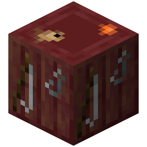
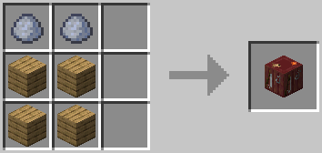

# Angling Table

An angling table is a block used to add and remove fishing rod parts from fishing rods.

<table>
<tr>
<th colspan="2">
Angling Table</th>
</tr>
<tr>
<td colspan="2" align="center">

{ width="200" }

</td>
</tr>
<tr>
<th align="left">Renewable</th>
<td>No</td>
</tr>
<tr>
<th align="left">Stackable</th>
<td>Yes (64)</td>
</tr>
<tr>
<th align="left">Tool</th>
<td>Wooden Axe</td>
</tr>
<tr>
<th align="left">Blast resistance</th>
<td>3</td>
</tr>
<tr>
<th align="left">Hardness</th>
<td>2.5</td>
</tr>
<tr>
<th align="left">Luminous</th>
<td>No</td>
</tr>
<tr>
<th align="left">Transparent</th>
<td>No</td>
</tr>
<tr>
<th align="left">Flammable</th>
<td>Yes</td>
</tr>
<tr>
<th align="left">Catches fire from lava</th>
<td>Yes</td>
</tr>
<tr>
<th align="left">Map color</th>
<td>28 COLOR_RED</td>
</tr>
<tr>
<th align="left">Note block instrument</th>
<td>Bass</td>
</tr>
</table>

## Obtaining

### Breaking

Angling tables can be mined by hand or with any tool, but axes are the quickest.

| Block    | Angling Table |
| -------- | ------------- |
| Hardness | 2.5           |
| Tool     | Axe           |

### Crafting

{ width="300" }

## Usage

### Fishing Rod Parts

When used, an interface is displayed with four kinds of input slots. Only one slot is interactable when there is no fishing rod inserted. When there is a fishing rod in the angling table, the player may attach or remove a fishing hook, fishing line, or sinker on the fishing rod.

### Fuel

Angling tables can be used as fuel in furnaces to burn for 300 ticks.

## History

| Version     | Change                |
| ----------- | --------------------- |
| alpha-0.6.0 | Added angling tables. |
